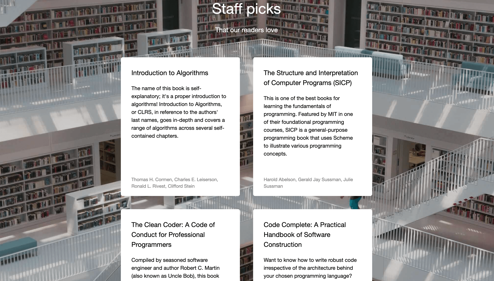

# Project 1: Triple Peaks Library

**View in your browser** [here]()

The Triple Peaks Library webpage is the first project in the Software Engineering
program at TripleTen. It was created using HTML and CSS, based on a design brief.

## Project features

- Semantic HTML5
- Flexbox
- Positioning
- Vertical stacking with z-index

## Screenshots

